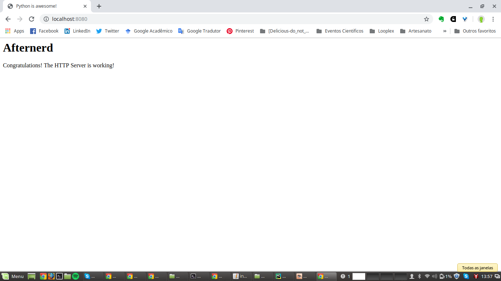

# tutorial_http_server
Vamos aprender como criar e configurar um servidor HTTP. Mas antes disso vamos revisar alguns conceitos.

## O que é Rede de Computadores?
Interligação de dois ou mais computadores e seus perifericos, com o objetivo de comunicação e compartilhamento de dados.

## Como funciona?

Para que essa interligação funcione de maneira ordenada, existem uma série de regras para que essa comunicação seja feita de maneira correta. 

A comunicação é feita em etapas por meio de camadas e protocolos. 

As camadas são:

| Camada |         Protocol |           Protocol Data Unit |     Addressing|
|--------|------------------|------------------------------|---------------|
|Application|     HTTP, SMTP, etc|     Messages |               NA |  
|Transport|       TCP, UDP|            Segment |                 Port # |
|Network|         IP|                  Datagram |                IP adress |  
|Data Link|       Ethernet, Wifi|      Frames |                  MAC adress |
|Physical|                       |     Bits |                     NA |


### Protocolos
Protocolos definem regras que:
- estabelece o formato e a ordem das mensagens as ações a serem tomadas na transmissão e recepção das mensagens


## HTTP- HyperText Transfer Protocol 
Segundo Tanembaum:

"O protocolo de transferência utilizado em toda a World Wide Web é o HTTP (HyperText Transfer
Protocol). Ele especifica as mensagens que os clientes podem enviar aos servidores e que respostas
eles receberão. Cada interação consiste em uma solicitação ASCII, seguida por uma resposta RFC
822 semelhante ao MIME. Todos os clientes e todos os servidores devem obedecer a esse protocolo.
Ele é definido na RFC 2616."


As principais características do HTTP são:

- orientado a conexão
- autocontida: não guarda o estado
- suporte para uso de cache:  o navegador guarda uma cópia da pagina, quando ela for acessada uma segunda vez o navegador pergunta se teve alguma alteração desde o último acesso
- Transferência bidirecional: tanto servidores quanto navegadores transmitem dados
- Suporte intermediário: servidores proxy


Os métodos internos de solicitações HTTP:

| Método| Descrição |
| ------|---------- |
| GET | Solicita a leitura de uma página da Web |
| HEAD | Solicita a leitura de um cabeçalho de página da Web |
| PUT | Solicita o armazenamento de uma página da Web | 
| POST | Acrescenta a um recurso (por exemplo, uma página da Web) |
| DELETE | Remove a página da Web | 
| TRACE | Ecoa a solicitação recebida |
| CONNECT | Reservado para uso futuro |
| OPTIONS | Consulta certas opções |


 Os grupos de respostas de código de status:
 
| Código | Significado | Exemplos |
| -------| ------------ | --------- |
| 1xx | Informação | 100 = server agrees to handle client's request |
| 2xx | Sucesso | 200 = request succeeded; 204 = no content present |
| 3xx | Redirecionamento | 301 = page moved; 304 = cached page still valid |
| 4xx | Erro do cliente | 403 = forbidden page; 404 = page can not found |
| 5xx | Erro do servidor | 500 = internal server error; 503 = try again later |


# O que é um servidor?

Pode parecer uma coisa muito complicada, mas um servidor, nada mais é, do que um um computador que armazena arquivos que compoem os sites, pode ser até o seu computador. Normalmente os servidores estao conectados a internet e podem ser acessados atráves do seu DNS. O servidor web inclui componentes que controlam como os usuários acessam os arquivos hospedados, como por exemplo, um servidor HTTP que compreende URLs e o protocolo que o navegador utiliza para acessar as paginas.

A imagem acima mostra o navegador solicitando dados do web server e esse retornando as informações hospedadadas. 

Um servidor pode ser estático ou dinâmico.No primeiro caso, as informações são entregues tal como foram criadas. Já no segundo caso, existe um servidor de aplicação e um banco de dados e as informações podem ser atualizadas antes de serem enviadas ao navegador. 

# Mãos a obra: é hora de configurar o servidor

(Tutorial baseado em https://www.afternerd.com/blog/python-http-server/)

Vamos criar o nosso servidor usando Python:

### Passo 1: Criar um arquivo html 

```
<html>
    <head>
        <title>Python is awesome!</title>
    </head>
    <body>
        <h1>Afternerd</h1>
        <p>Congratulations! The HTTP Server is working!</p>
    </body>
</html>
```

### Passo 2: Criar o servidor usando Pyhton

```
import http.server
import socketserver

PORT = 8080  # porta em que o servidor vai rodar
Handler = http.server.SimpleHTTPRequestHandler  # manipulador de solicitações http

httpd =socketserver.TCPServer(("", PORT), Handler)   #
#with socketserver.TCPServer(("", PORT), Handler) as httpd:
print("serving at port", PORT)

#serve_forever is a method on the TCPServer instance
# that starts the server and begins listening and responding to incoming requests.
httpd.serve_forever()

```

### Passo 3: Executar o código 

```
python3 server.py
```




# Referências
- https://developer.mozilla.org/pt-BR/docs/Web/HTTP/Overview
-


